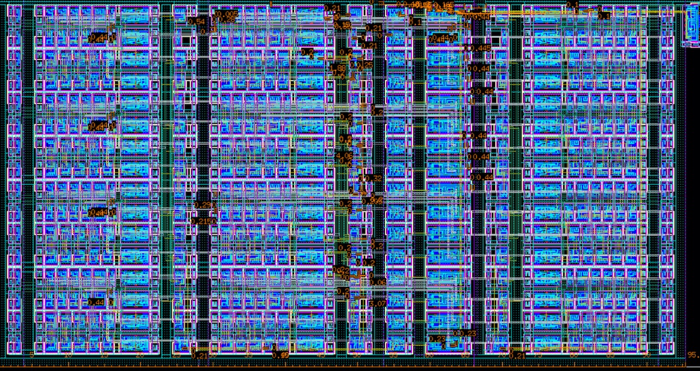

# Adjustable PWM Modulator

## Project Overview

**Project Title:** Adjustable PWM Modulator Chip  
**Team Members:** Yi Tong  
**Objective:** Build a frequency-adjustable and duty-cycle-adjustable PWM modulator for industrial applications such as motor control, audio amplification, power regulation, and signal encoding.  

This project integrates various schematics (counters, D Flip-flop, adder, comparison circuit) to achieve a PWM generator with low power consumption.

## Features

- **Adjustable Frequency**: Adjust the PWM frequency by varying the Auto-Reload Register (ARR).
- **Adjustable Duty Cycle**: Adjust the PWM duty cycle by modifying the Capture/Compare Register (CCR).
- **Low Power Consumption**: The design is optimized for low power usage, consuming about 15.12 μW at 10 MHz.

## Circuit Design

The PWM generator consists of the following major components:

- **Input Signals**:  
  - `CCR` (16-bit): Capture/Compare register, adjusts the duty cycle.  
  - `ARR` (16-bit): Auto-reload register, adjusts the frequency.  
  - `Rst_n`: Reset signal.  
  - `Clk`: Clock signal.

- **Output Signals**:  
  - `Pwm_out`: PWM output signal.

## Layout and Design

- **16-bit Carry-Lookahead Adder (CLA)**: Used for fast addition of binary numbers in the circuit, optimized for speed and minimal power consumption.
- **16-bit D-Flipflop**: Stores binary data with a clock edge, ensuring the correct timing for the PWM output.
- **PWM Generator**: The final layout integrates all the components into a single functional PWM generator.

## Simulation and Testing

...

